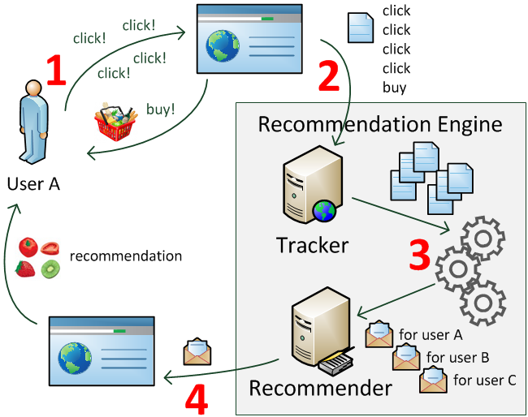

# Ten Minutes Guide

This Ten Minutes Guide gives a basic overview of how the personalization engine works and how it is typically enabled. Following is an example for the integration in an e-commerce shop.

## How it works

The idea of the recommendation engine is quite simple and built upon four main steps.

A User visits an online shop, navigates through it and leaves some footprints. The most popular footprints are selecting and purchasing  products **(1)**. This information is sent to the event tracker service of the recommendation engine every time these events happen **(2)**. The recommendation engine accumulates the tracked events, categorizes them and calculates recommendations for every product and every user in the shop **(3)**. All recommendations are available over the recommender service. They can be fetched and presented to users during their sessions or sent out e.g. as a newsletter **(4)**.



#### Integration

Integration is based on the following:

- activation of user tracking (we respect privacy rules and never store any data related to a person, every event is anonymized)
- embedding recommendations into a website.

!!! note

    Below we use the mandator ID '00000' for creating requests. You must substitute it with your own ID which is generated and sent to you by mail at the end of a successful registration process under [https://admin.yoochoose.net](https://admin.yoochoose.net/).

### Tracking Events

Step one is called tracking. Every page must call special tracking URL. The simplest way is to place a tiny image on every product page, just it is usually done for analytic tools or visitor counter. It looks like this:

**``**

Replace "john.smith" with the user ID or session ID of the user currently signed in on your website (any URL encoded string is allowed).
Replace "123" with the ID of the content you want to track and later on recommend.

The following code snippets provide example code for the integration of a click event:

PHP:

``` php
$mandator_id = '00000';
$product_id = '123';
$server = '//event.yoochoose.net';
$tracking = $server.'/ebl/'.$mandator_id.'/click/'.urlencode(session_id()).'/1/'.$product_id;
echo "";
```

Javascript:

``` js
var mandator_id = '00000';
var product_id = '123';
var server = '//event.yoochoose.net';
var url = server + '/api/' + mandator_id + '/click/' + getSessionId() + '/1/' + product_id;
var ycimg=new Image(1,1);
ycimg.src=url;
```

A similar tracking image must be placed on the confirmation page after the payment process.

``` php
$server = '//event.yoochoose.net';
foreach ($just_bought_products as $product_id) {
   $tracking = $server.'/ebl/'.$mandator_id.'/buy/'.urlencode(session_id()).'/1/'.$product_id;
   echo "\n";
}
```

### Embedding Recommendations

Depending on the page impressions/visits the recommendation engine has soon collected enough events and is able to generate recommendations. The more tracking data is available, the better and sharper the recommendations will be. Recommendations can be fetched using following calls, the response is returned as JSON.

**`http://reco.yoochoose.net/api/v2/00000/john.smith/landing_page.json`**
Returns the most popular products.

**`http://reco.yoochoose.net/api/v2/00000/john.smith/cross_sell.json?contextitems=OWNS,CLICKED`** Returns products the current user (here "**`john.smith`**") is most probably interested in, so-called personalized recommendations.

**`http://reco.yoochoose.net/api/v2/00000/john.smith/cross_sell.json?contextitems=123`**
Returns products most probably interesting for any user who is interested in product 123.

Example result with two recommendations:

``` json
{
   "contextItems":[
      {
         "itemId":123,
         "itemType":1,
         "sources":[
            "REQUEST"
         ],
         "viewers":0
      }
   ],
   "recommendationItems":[
      {
         "itemId":555,
         "itemType":1,
         "relevance":127,
         "links":{
            "clickRecommended":"//event.yoochoose.net/api/00000/clickrecommended/user/1/555?scenario=landing_page&modelid=5768",
            "rendered":"//event.yoochoose.net/api/00000/rendered/user/1/555?scenario=landing_page&modelid=5768"
         }
      },
      {
         "itemId":444,
         "itemType":1,
         "relevance":126,
         "links":{
            "clickRecommended":"//event.yoochoose.net/api/00000/clickrecommended/user/1/444?scenario=landing_page&modelid=5768",
            "rendered":"//event.yoochoose.net/api/00000/rendered/user/1/444?scenario=landing_page&modelid=5768"
         }
      }
   ]
}
```

Here is a small PHP snippet for making request and parsing results:

``` php
$mandator_id = '00000';
$license_key = '86109-2778-8757-7597-4319';
$server = "http://reco.yoochoose.net";
$scenario = "category_page";
$url = $server.'/ebl/00000/'.urlencode(session_id()).'/'.urlencode($scenario).'.json';

$curl = curl_init();
$request = array(
  CURLOPT_URL => $url,
  CURLOPT_RETURNTRANSFER => true,
  CURLOPT_USERPWD => "$mandator_id:$license_key");
curl_setopt_array($curl, $request);
$body = curl_exec($curl);
$recommendations = json_decode($body);
if ($recommendations && isset($recommendations->recommendationResponseList)) {
  foreach ($recommendations->recommendationResponseList as $product) {
    $product_id = $product->itemId;
    # load the product and create the recommendation HTML here
    echo($product->itemId);
    echo(" \n");
  };
} else {
    echo("Error: ".$body);
}
curl_close($curl);
```

## Next steps

For the most simple but still very effective recommendations the steps described above are sufficient. Tracking more events, using additional parameters and custom scenario configurations enable features like:

- Filtering recommendations based on category
- Getting usage and revenue statistics
- Recommendations based on the shopping basket
- Filtering repeated recommendations

Additional features are available for the Advanced edition of the recommendation engine:

- A/B testing
- Personalized Search
- Using "rate" and "like" events
- Additional models such as content-based, random, history etc.
- Multiple product types (for example food/non-food or article/image/video) and cross-type recommendations
- Price-based filtering (do not recommend cheap products)
- Grouping products by custom attributes (size, color, source, theme etc.)

More detailed information can be found in the [User Guide](user_guide/introduction.md).
